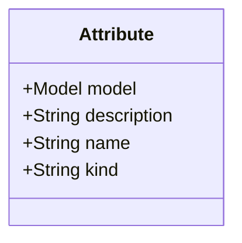
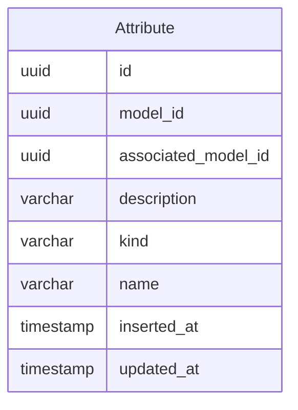
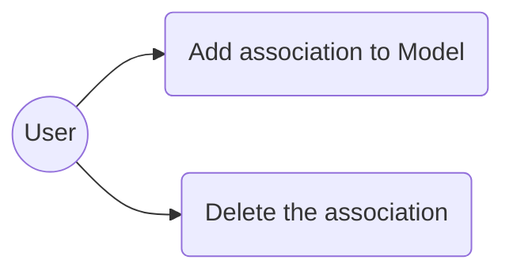

# ModelAssociation

## Model

```mermaid
classDiagram
    class Attribute{
        +Model model
        +String description
        +String name
        +String kind
    }
```

## Record

```mermaid
erDiagram
    Attribute {
        uuid id
        uuid model_id
        uuid associated_model_id
        varchar description
        varchar kind
        varchar name
        timestamp inserted_at
        timestamp updated_at
    }
```

## Use cases

```mermaid
flowchart LR
    U((User))

    U --> A1(Add association to Model)
    U --> A2(Delete the association)
```
