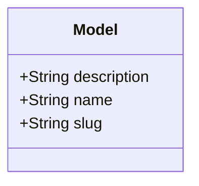
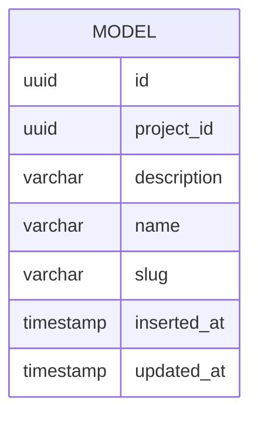
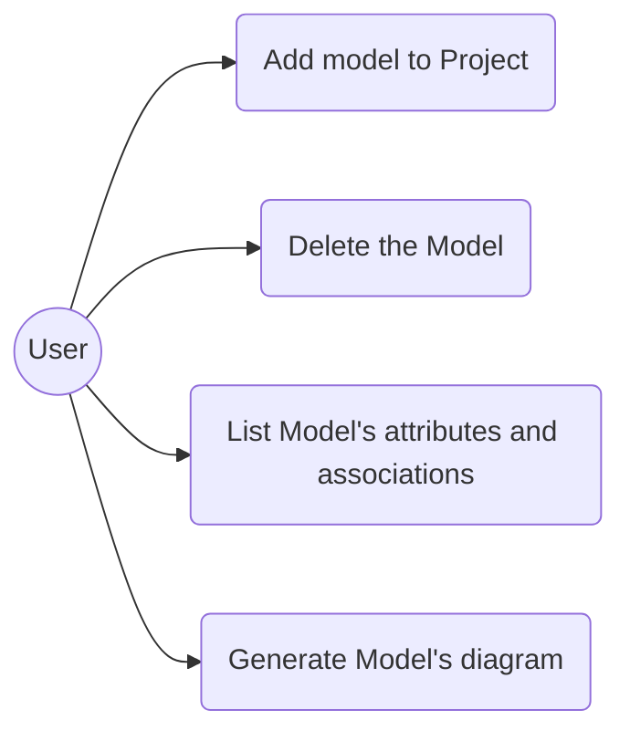

# Model

## Model

```mermaid
classDiagram
    class Model{
        +String description
        +String name
        +String slug
    }
```

## Record

```mermaid
erDiagram
    MODEL {
        uuid id
        uuid project_id
        varchar description
        varchar name
        varchar slug
        timestamp inserted_at
        timestamp updated_at
    }
```

## Use cases

```mermaid
flowchart LR
    U((User))

    U --> A1(Add model to Project)
    U --> A2(Delete the Model)
    U --> A3(List Model's attributes and associations)
    U --> A4(Generate Model's diagram)
```
