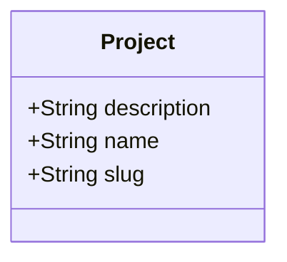
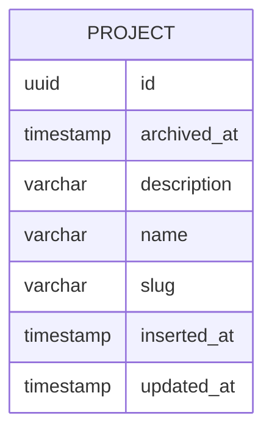
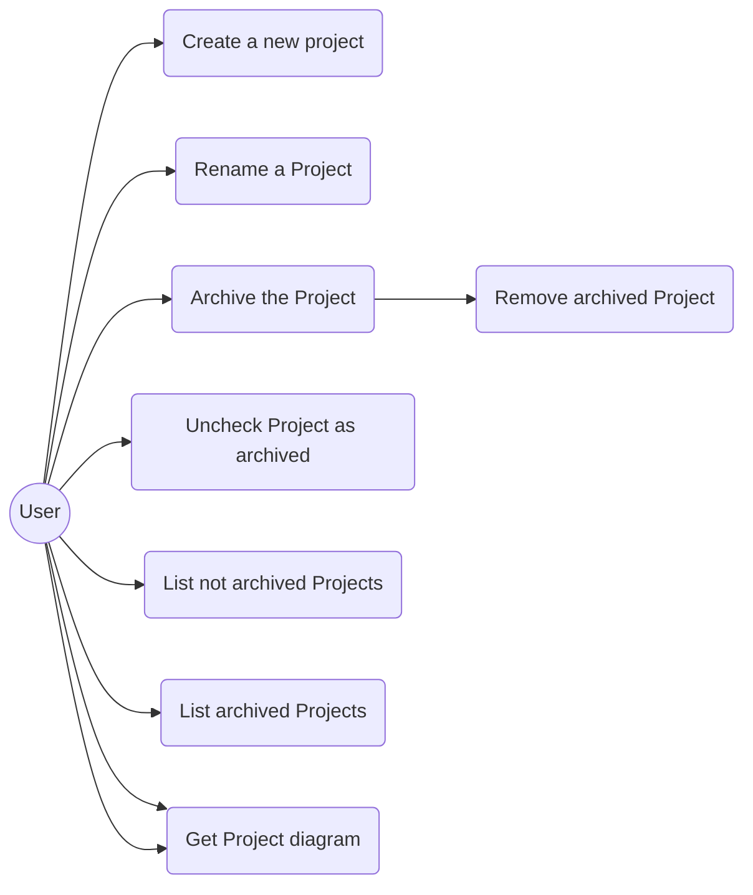

# Project

## Model

```mermaid
classDiagram
    class Project{
        +String description
        +String name
        +String slug
    }
```

## Record

```mermaid
erDiagram
    PROJECT {
        uuid id
        timestamp archived_at
        varchar description
        varchar name
        varchar slug
        timestamp inserted_at
        timestamp updated_at
    }
```

## Use cases

```mermaid
flowchart LR
    U((User))

    U --> A1(Create a new project)
    U --> A2(Rename a Project)
    U --> A4(Archive the Project)
    A4 --> A5(Remove archived Project)
    U --> A6(Uncheck Project as archived)
    U --> A7(List not archived Projects)
    U --> A8(List archived Projects)
    U --> A9(Check Project details)
    U --> A9(Get Project diagram)
```
