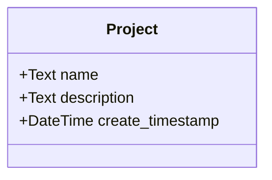
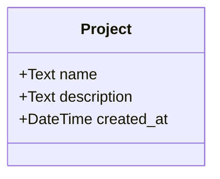
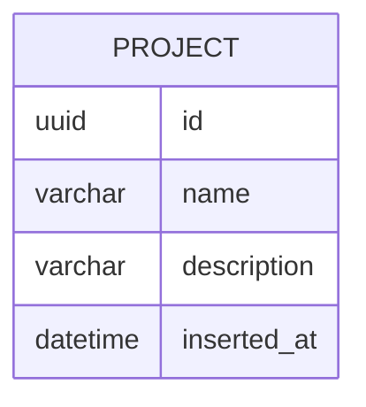
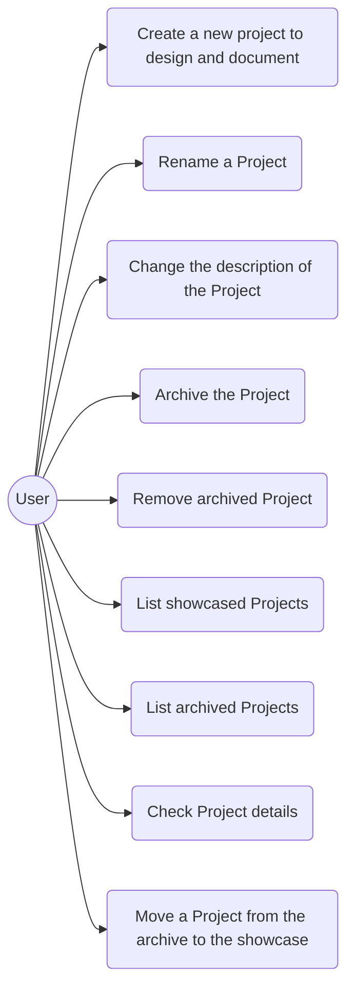

# Project

## Presenter

## Model

## Entity

## Validations

* Name
    * contain any UTF-8 characters including emojies
    * unique within the list of projects
    * can not be empty
    * minimum 1 byte
    * maximum 1000 bytes
* Description
    * can contain any UTF-8 characters including emojies
    * can be empty
    * maximum 10000 bytes

## Use cases

Implementation progress:
* [ ] Create a new project to design and document
* [ ] Rename a Project
* [ ] Change the description of the Project
* [ ] Archive the Project
* [ ] Remove archived Project
* [ ] List showcased Projects
* [ ] List archived Projects
* [ ] Check Project details
* [ ] Move a Project from the archive to the showcase
